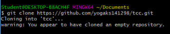
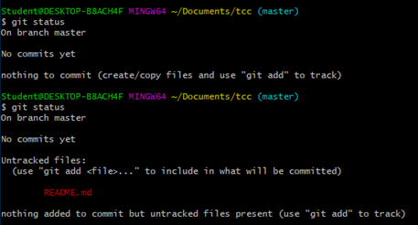
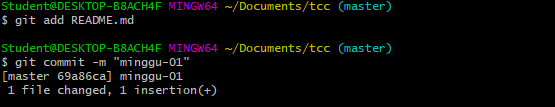
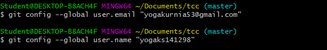
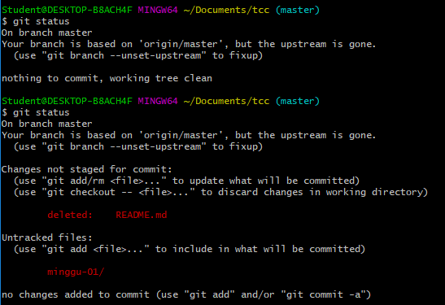
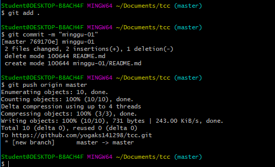
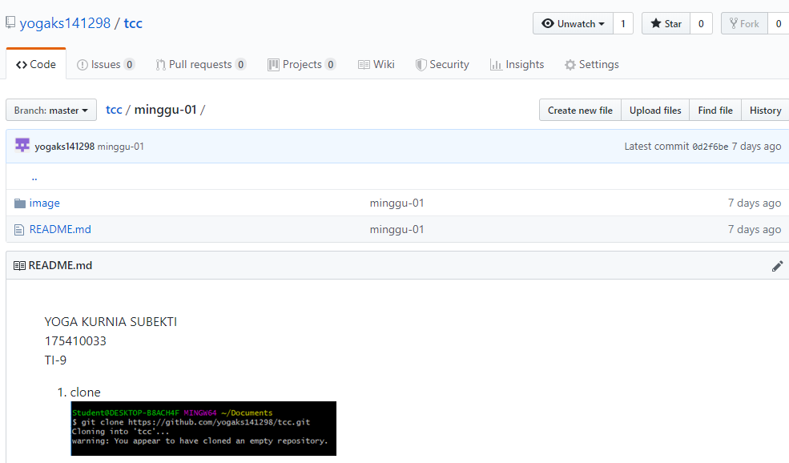

YOGA KURNIA SUBEKTI  
175410033  
TI-9  

1. clone  

2. pindah direktori menjadi tcc (master)  
  

3. melihat status git sebelum diedit   
  

4. menambahkan file README.md dan menyimpannya di minggu-01 
  

5. memasukkan username dan email  
   

6. hasil setelah mengubah file  
   

7. menambahkan semua file yang ada dan disimpan di folder minggu-01 dan di push
 

8. hasil repository
