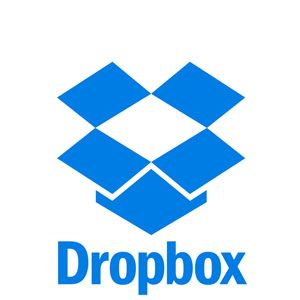

# Praktikum Teknologi Cloud Computing
Nama : Yoga Kurnia S  
NIM  : 175410033  
***   

## SaaS (Software as a Service)
        Software as a Service adalah layanan software yang digunakan melalui internet. Sebenarnya hal ini bukan merupakan hal yang asing dan sering kita gunakan (hanya mungkin kita belum tahu aja), contoh dari SaaS ini adalah google docs, facebook, aplikasi CRM berbayar, dan lain-lain. Pengguna hanya perlu menggunakan aplikasi tersebut tanpa harus mengerti bagaimana data disimpan, bagaimana aplikasi tersebut di maintenance, karena hal tersebut merupakan service yang disediakan penyedia jasa.   

        Pembayaran dari penggunaan aplikasi-aplikasi ini pun hanya per pemakaiannya (terkadang ada yang tak berbayar tetapi ada fitur-fitur tertentu yang bisa didapatkan ketika pengguna membayar fitur-fitur tersebut, yah semacam nyewa parabola gitu lah, bayar berdasar channel yang diinginkan). Dari sinilah muncul istilah Pay per use, pay as you go dan lain sebagainya. Yang jelas, dengan menggunakan SaaS banyak perusahaan yang terbantu untuk menekan biaya yang harus dikeluarkan untuk membeli sebuah perangkat lunak.

Keuntungan :  
- Pengguna dapat langsung memanfaatkan layanan secara gratis atau dengan bayar biaya sewa tanpa harus mengeluarkan investasi untuk membuat sendiri (in-house development) atau membeli lisensi yang relatif mahal.

- Ketersediaan dan reliabilitas aplikasi terjamin oleh penyedia layanan. Pengguna hanya perlu fokus pada data miliknya. Perangkat yang dibutuhkan oleh pengguna juga hanya komputer dan internet.

Kerugian :

Pengguna tidak memiliki kendali penuh atas aplikasi yang disewa. Pengguna tidak dapat dengan seenaknya mengubah fitur-fitur yang disediakan karena SaaS bersifat multi-tenant sehingga fitur-fitur yang dibuat adalah fitur yang umum (tidak bisa spesifik terhadap kebutuhan pengguna tertentu). Pada beberapa aplikasi, kustomisasi dapat dilakukan dengan skala dan fungsi yang terbatas.

## Contoh:  
Dropbox   
  
Dengan penyimpanan 1TB yang dapat anda bagi pada banyak perangkat yang Anda miliki, Dropbox Pro menyediakan nilai lebih pada setiap tingkat biaya evaluasi. Dengan dilengkapi kecepatan backup dan restore file yang sangat cepat. Namun, kemudahan dalam penggunaan yang sangat lemah serta sistem security yang kurang dibanding sistem backup yang lain.  
kelebihan : Kecepatan backup dan restore yang baik  
kekurangan : Lemahnya sistem security dibanding sistem backup lain

## Arsitektur SaaS
Model SaaS meliputi konsep-konsep dalam arsitektur aplikasi terdistribusi tetapi lebih lanjut memperluas arsitektur
untuk menyertakan komponen untuk memfasilitasi dan meningkatkan model bisnis. Sebuah vendor perangkat lunak
tradisional terutama berkaitan dengan kemampuan aplikasi dan pelanggan mereka yang bertanggung jawab untuk mengoperasikan dan mengelola lingkungan yang bersangkutan di mana mereka menjalankan perangkat lunak. 
