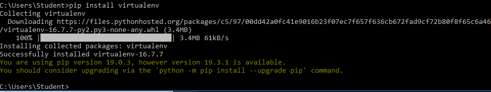
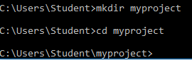
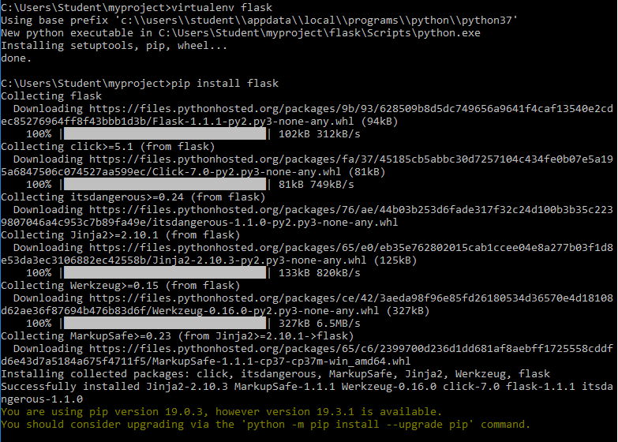
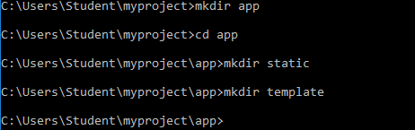

# TCC
Yoga Kurnia Subekti  
175410033

1. buka command prompt lalu ketikkan perintah
    pip install virtualenv
    
2. buat directory dengan nama myproject
    
3. install flask
    
4. buat beberapa direktory
    

http://www.wawanhn.com/2015/12/install-microframework-flask-untuk.html
